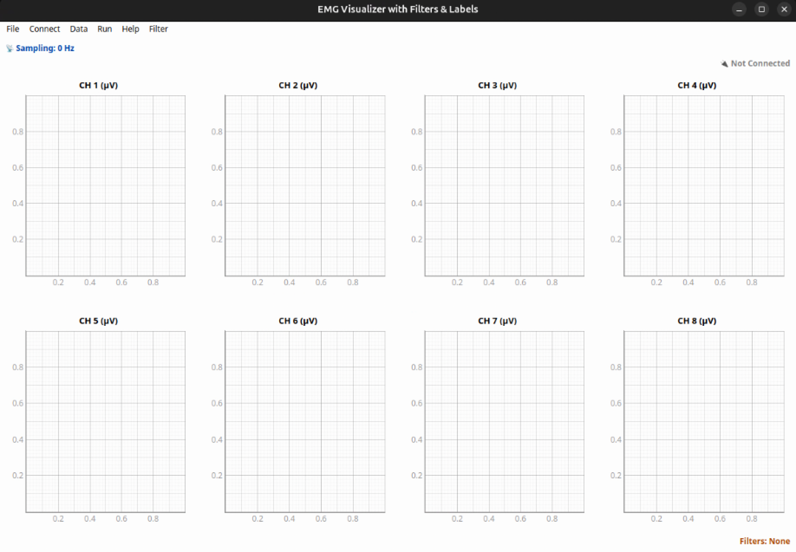

# EMG project w/CJ
Robot Control Based on EMG Signals in the Isaac Sim Environment 🤖

### Default Setup 🚀
#### 1. Conda Environment
Environment name: 'test'

``` bash
$ conda activate test
```

#### 2. ROS2 setup
``` bash
$ cd ros2_ws
$ source /opt/ros/jazzy/setup.bash
$ source install/setup.bash
```

- If you have updated the ROS2 code, run the following commands in your ros2_ws workspace:
``` bash
$ colcon build
$ source install/setup.bash
```
### Isaac sim Setup 🦾
#### 1. Conda Environment
Environment name: 'env_isaacsim'
``` bash
$ conda activate env_isaacsim
```

#### 2. Start Isaac Sim
```
$ cd isaacsim
$ isaacsim
or
$ ./isaac-sim.sh
```


### Package Description 🧑‍💻
#### 1. emg_connect
- Connects to the EMG device and retrieves EMG signals. 
- Developed by CJ 🥸
- Run Python File
: main_gui.py
  
<br/>

  
> ‼️ Before start blew package, you must done ROS2 setup ‼️

#### 2. emg_device
- This package is for the **right-hand EMG device**.

##### - ROS2 Launch Files 

1. Connect to the EMG device
- Scan for the EMG device → connect
``` bash
$ ros2 launch emg_device emg_signal_launch.py
```

2. Full pipeline: EMG connection + classification + robot control (Isaac Sim) ⭐️
- Scan for the EMG device → connect → wait 10s → start classification
``` bash
$ ros2 launch emg_device emg_full_pipeline_launch.py 
```
<br/>


#### 3. emg_device_left
- This package is for the **left-hand EMG device**. 

##### - ROS2 Launch Files 

1. Connect to the EMG device
- Scan for the EMG device → connect
``` bash
$ ros2 launch emg_device_left emg_signal_launch.py
```

2. Full pipeline: EMG connection + classification + robot control (Isaac Sim) ⭐️
- Scan for the EMG device → connect → wait 10s → start classification
``` bash
$ ros2 launch emg_device_left emg_full_pipeline_launch.py 
```
<br/>

#### 4. emg_shadow_hand_bridge
- Controls the Shadow Hand robot in the Isaac Sim environment.
- Make sure to launch `emg_full_pipeline_launch.py` first. ‼️

##### - ROS2 Run Files
- Right-hand control
``` bash
$ ros2 run emg_shadow_hand_bridge shadow_hand_gesture_control
```

- Left-hand control
``` bash
$ ros2 run emg_shadow_hand_bridge shadow_hand_gesture_control_left
```
