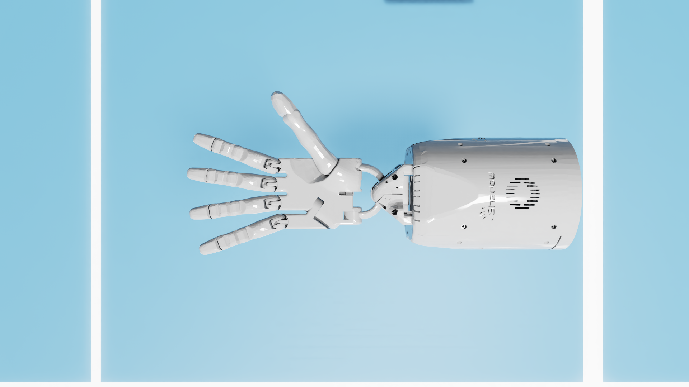
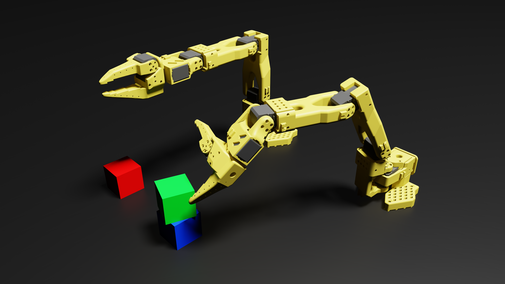

# EMG project w/CJ
Robot Control Based on EMG Signals in the Isaac Sim Environment 🤖

## Default Setup 🚀
### 1. Conda Environment
Environment name: 'test'

``` bash
$ conda activate test
```

### 2. ROS2 setup
``` bash
$ cd ros2_ws
$ source /opt/ros/jazzy/setup.bash
$ source install/setup.bash
```

- If you have updated the ROS2 code, run the following commands in your ros2_ws workspace:
``` bash
$ colcon build
$ source install/setup.bash
```
## Isaac sim Setup 🦾
### 1. Conda Environment
Environment name: 'env_isaacsim'
``` bash
$ conda activate env_isaacsim
```

### 2. Start Isaac Sim
``` bash
$ cd isaacsim
$ isaacsim
or
$ ./isaac-sim.sh
```


## Package Description 🧑‍💻
### 1. emg_connect
- Connects to the EMG device and retrieves EMG signals. 
- Developed by CJ 🥸
- Run Python File
: main_gui.py
  
<br/>

  
> ‼️ Before start blew package, you must done ROS2 setup ‼️

### 2. emg_device
- This package is for the **right-hand EMG device**.

#### - ROS2 Launch Files 

1. Connect to the EMG device
- Scan for the EMG device → connect
``` bash
$ ros2 launch emg_device emg_signal_launch.py
```

2. Full pipeline: EMG connection + classification + robot control (Isaac Sim) ⭐️
- Scan for the EMG device → connect → wait 10s → start classification
``` bash
$ ros2 launch emg_device emg_full_pipeline_launch.py 
```
<br/>


### 3. emg_device_left
- This package is for the **left-hand EMG device**. 

#### - ROS2 Launch Files 

1. Connect to the EMG device
- Scan for the EMG device → connect
``` bash
$ ros2 launch emg_device_left emg_signal_launch.py
```

2. Full pipeline: EMG connection + classification + robot control (Isaac Sim) ⭐️
- Scan for the EMG device → connect → wait 10s → start classification
``` bash
$ ros2 launch emg_device_left emg_full_pipeline_launch.py 
```
<br/>

### 4. emg_shadow_hand_bridge
- Controls the Shadow Hand robot in the Isaac Sim environment.
- Make sure to launch `emg_full_pipeline_launch.py` first. ‼️

#### - ROS2 Run Files
- Right-hand control
``` bash
'''
- command
1~0: keyboard control
e: emg mode on/off
'''
$ ros2 run emg_shadow_hand_bridge shadow_hand_gesture_control
```

- Left-hand control
``` bash
'''
- command
1~0: keyboard control
e: emg mode on/off
'''
$ ros2 run emg_shadow_hand_bridge shadow_hand_gesture_control_left
```


<br/>

### 5. so101
- Controls the so-101(manipulator) robot in the Isaac Sim environment $ real world
- Make sure to launch `emg_full_pipeline_launch.py` ‼️

<br/>

- Turn on the so-101 robot
``` bash
# Conda Environment name: 'base'
$ conda activate base
$ cd ros2_ws/src/so101/gkim451/demo

# Left-hand
$ python ./run.py \
  --port /dev/follower_0 \
  --id lerobot_follower_0 \
  --cmd cmd.json \
  --hz 30

# Right-hand
$ python ./run.py \
  --port /dev/follower_1 \
  --id lerobot_follower_1 \
  --cmd cmd1.json \
  --hz 30
```

<br/>

#### - ROS2 Run Files
- control so-101 in Isaac Sim envrironment
``` bash
'''
- command
1~0: keyboard control
e: emg mode on/off
r: reset pose
u: speed up!
d: speed down!
'''
# Left-hand
$ ros2 run so101 so101

# Right-hand
$ ros2 run so101 so101_right
```

- Real robot control
``` bash
# Left-hand
$ ros2 run so101 so101_real_control

# Right-hand
$ ros2 run so101 so101_real_control_right
```


## System Workflow

### Shadow Hand Control

1. Activate the conda environment `test`.
2. Launch the `emg_device` package (connect to the EMG device).
3. Start Isaac Sim and click **Play**.
4. Run the `emg_shadow_hand_bridge` node (connects Isaac Sim to the EMG device).


### SO-101 Control

1. Activate the conda environment `test`.
2. Launch the `emg_device` package (connect to the EMG device).
3. Start Isaac Sim and click **Play**.
4. Run the `so101` node (connects Isaac Sim to the EMG device).
5. Run the `so101_real_control` node (controls the real robot).


<br/>

## Contact(문의) 🧑‍🔧
- Repair Engineer 1   
Jeongseo Jang 🐈‍⬛  
e-mail: tj6774@gmail.com   
@JEONGSE0

- Repair Engineer 2  
Cheoljeong Park 🦦  
e-mail: cheoljeongpark@gmail.com

- Tonkatsu Hammer & Repair Enginee 3   
Gyuwon Kim 🥩🔨  
e-mail: gyuwon.kim@gatech.edu

